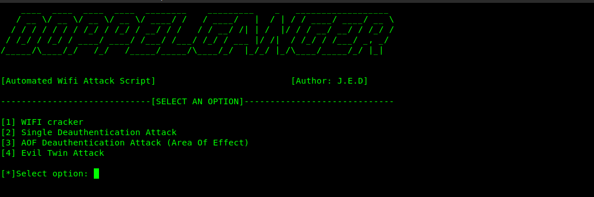
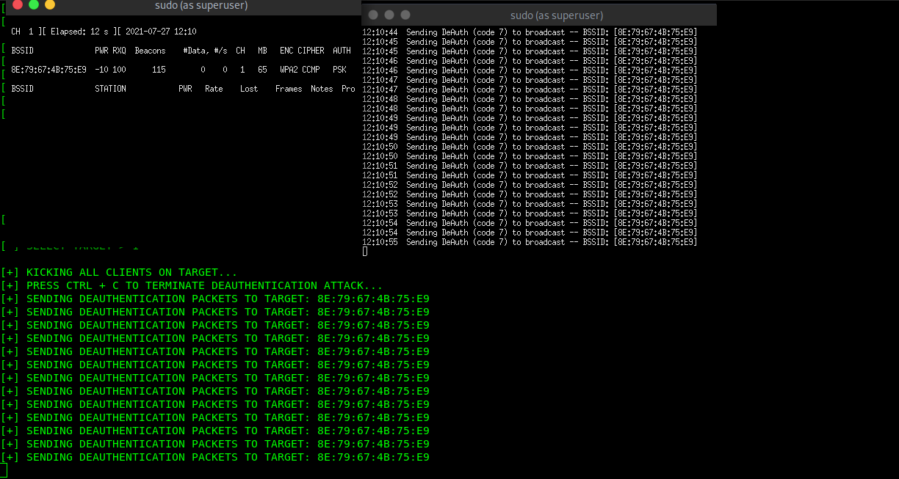
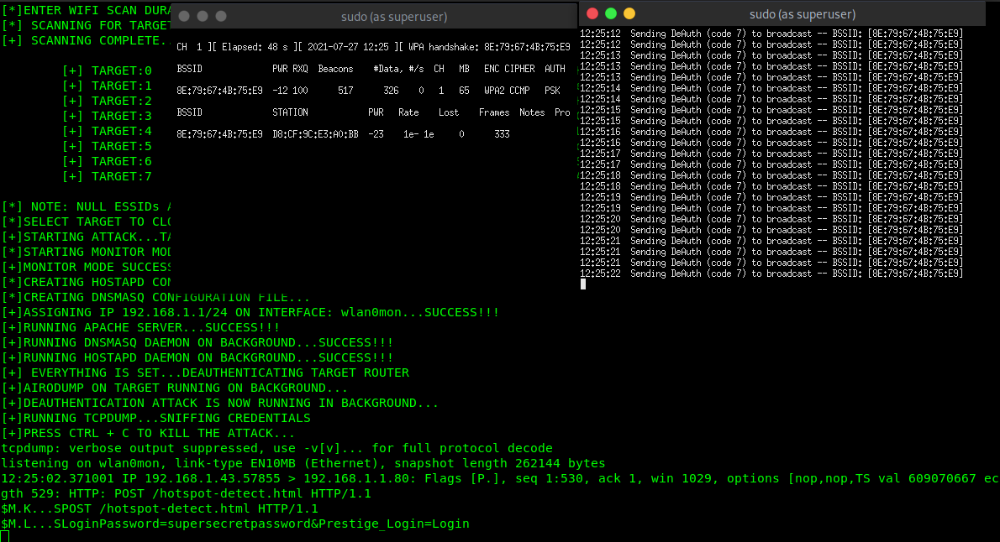

# DOPPELGANGER

Doppelganger is an automation script written in python designed to crack WEAK DEFAULT PLDT and GLOBE wifi passwords using bruteforce, deauthenticate clients from a wireless network, and launch an Evil Twin Attack. The bruteforce attack is implemented by piping the output of crunch, a wordlist generator, to aircrack-ng which is a tool for cracking WEP and WPA/WPA2-PSK.

PLEASE NOTE: This has only been tested on linux. I am currently using a debian-based linux distribution.

# LIST OF ALL FEATURES
- Automates changing to monitor mode and back to managed mode
- Wifi cracker
- Single Target Deauthentication Attack
  
- Area OF Effect Deauthentication Attack
- Evil Twin Attack

# AREA OF EFFECT DEAUTHENTICATION ATTACK
THIS WILL LAUNCH A DEAUTHENTICATION ATTACK TO ALL WIFI NETWORKS WITHIN YOUR RANGE. All device will be deauthenticated to their networks and cannot authenticate back as long as this attack is running. User can specify the attack duration in seconds.

# WIFI CRACKER
The user can choose 3 different cracking mode: PLDT default, GLOBE default, and custom wordlist.
- PLDT default - The attack will bruteforce the last 5 characters of the key phrase PLDTWIFI@@@@@ where '@' is a mix-alphanumeric character set. Example: PLDTWIFIaaaaa, PLDTWIFIaaaab, PLDTWIFIaaaac, and so on.
- GLOBE default - The attack will bruteforce an 8 character long password @@@@@@@@ where '@' is an alphanumeric character set.
- Custom wordlist - The path of the custom wordlist is hardcoded. In the code, the path is /usr/share/wordlists/rockyou.txt. You can modify the code by changing the default path that is hardcoded in the script and use your custom wordlist path.

# EVIL TWIN ATTACK

The evil twin attack works by cloning a wireless access point and runs a modified web server with a malicious log in page. You can clone any webpage using httrack, store it in your var/www/html and customize it to your preference to make it look more 'convincing' to anyone who'll connect to your evil twin network.
By selecting a target, the script will deauthenticate the selected target and clone the SSID of your wireless network target. All clients connected to the target cannot authenticate to their wireless access point as long as the deauthentication attack is running. If someone connects to your evil twin access point, the victim will then be redirected to a captive portal. As tcpdump runs in the background, all passwords that are entered by the victim connected to your evil twin network will be intercepted. As you can see below the picture, the password "supersecretpassword" has been intercepted. The Evil Twin Attack uses http.
- PLEASE DO NOTE: Some devices do not automatically redirect to captive portals. The evil twin attack does not work on all devices.

# THIS SCRIPT IS CREATED FOR EDUCATIONAL PURPOSE ONLY
This is just a proof of concept. I am not reliable if you're gonna use this script for malicious purposes

# PLEASE DO NOTE
You need a wireless adapter that is capable of monitor mode and packet injection in order for the script to work
The 000-default.conf file is my apache configuration. I used this configuration to redirect devices to my captive portal when the evil twin attack option is selected.
